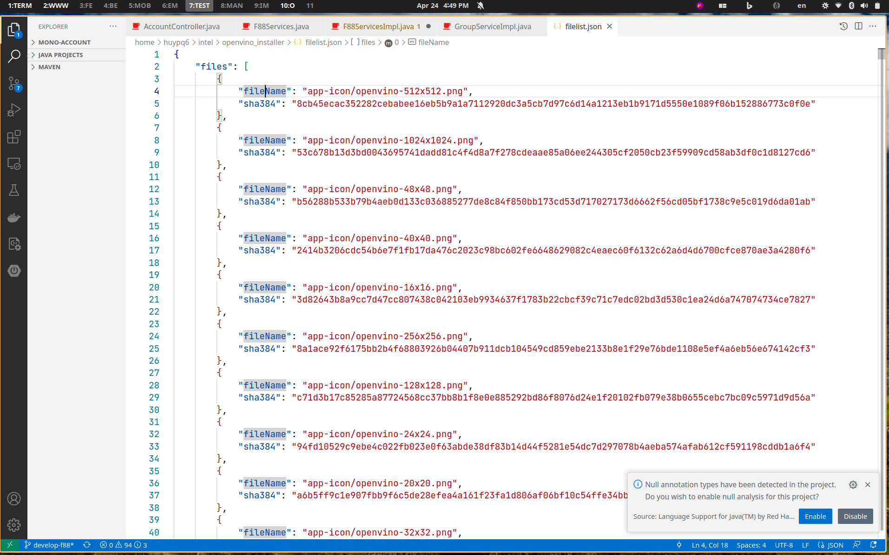
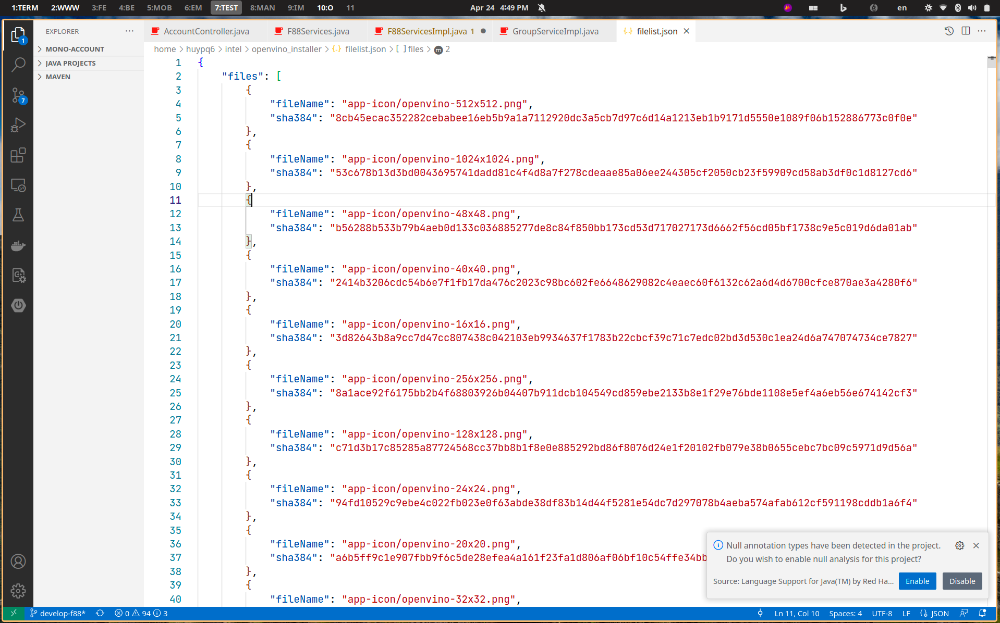

# This is configuration to enhance your thinkpad using LINUX

## 1. Monitor
Currently, i am using Thinkpad P14s with basic screen 1920x1200 resolution, 45% NTSC. 

This screen is not good for reading and coding, so i calirated and modified color a litte bit for viewing comfortable. 

Below is before and after calibrated


**Before**


**After**

## 2. Fans
The fans is always running with high rpm. And it still running in sleeping mode. It is not good. 
Fortunately, i found an articles to fix this issue [here](https://blog.monosoul.dev/2021/10/17/how-to-control-thinkpad-p14s-fan-speed-in-linux/). 
Followed the guide and i used this configuration for ```thinkfan.conf``` the problem was resolved.

```
sensors:
# GPU
- tpacpi: /proc/acpi/ibm/thermal
  indices: [1]
# CPU
- hwmon: /sys/class/hwmon
  name: coretemp
  indices: [2, 3, 4, 5]
# Chassis
- hwmon: /sys/class/hwmon
  name: thinkpad
  indices: [3, 5, 6, 7]
# SSD
- hwmon: /sys/class/hwmon
  name: nvme
  indices: [1, 2, 3]
  correction: [-5, 0, 0]
# MB
- hwmon: /sys/class/hwmon
  name: acpitz
  indices: [1]

fans:
  - tpacpi: /proc/acpi/ibm/fan

levels:
  - [0,	0,	53]
  - [1,	46,	60]
  - [2,	58,	65]
  - [3,	62,	70]
  - [4,	68,	75]
  - [5,	73,	80]
  - [6,	78,	85]
  - [7,	85,	32767]
```

## 3. Touchpad

The touchpad is sill laggy, but i have not found to solution for it.